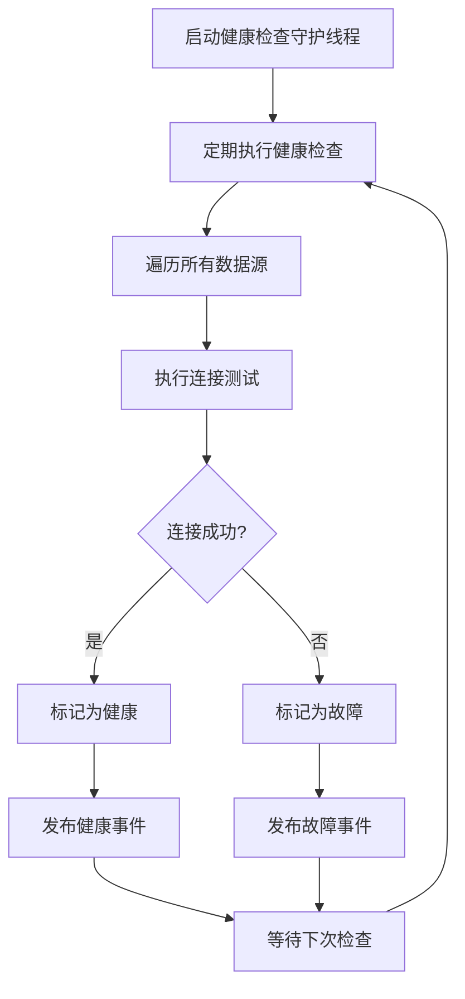
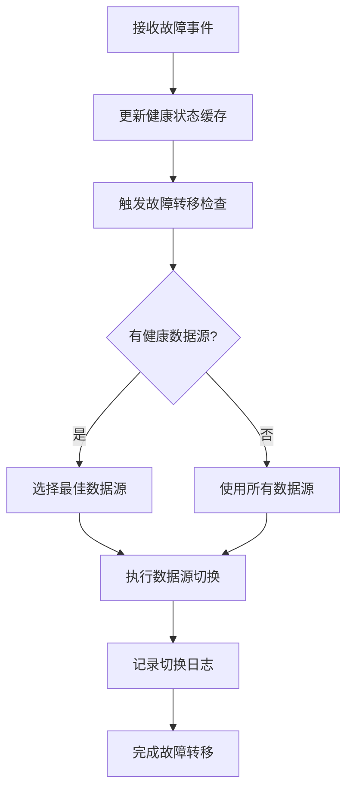
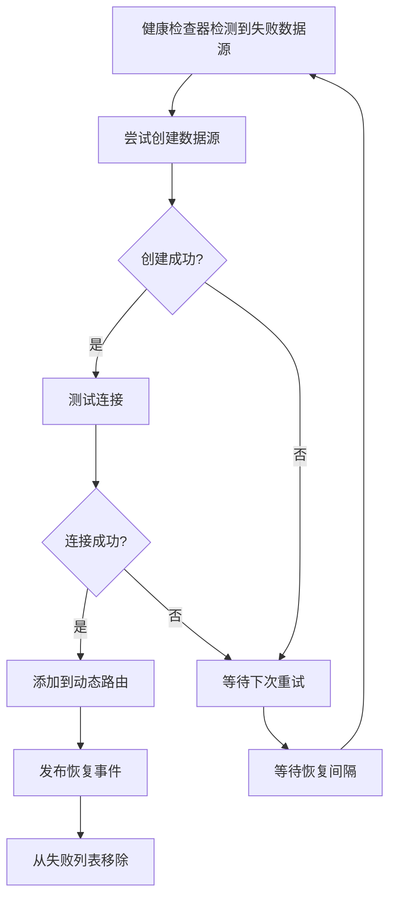

# 健康检查与故障转移使用指南

## 概述

Synapse Framework 数据库模块提供了强大的健康检查和故障转移功能，确保数据源的高可用性和可靠性。本指南详细介绍如何配置和使用这些功能。

## 核心组件

### 1. DataSourceHealthChecker
- **功能**：单线程守护进程，定期检查数据源健康状态
- **特点**：避免多线程竞争，确保检查的准确性
- **职责**：健康检查、故障检测、数据源恢复

### 2. FailoverRouter
- **功能**：智能数据源路由和故障转移
- **特点**：基于事件驱动架构，实时响应故障
- **职责**：路由决策、故障转移、负载均衡

### 3. DataSourceHealthEventPublisher
- **功能**：发布数据源健康状态事件
- **特点**：解耦健康检查和故障转移逻辑
- **职责**：事件发布、状态通知

### 4. DataSourceFactory
- **功能**：统一的数据源创建工厂
- **特点**：支持多种数据库类型和连接池
- **职责**：数据源创建、配置管理

## 配置详解

### 基础配置

```yaml
synapse:
  datasource:
    # 主数据源名称
    primary: master1
    
    # 健康检查配置
    health-check:
      enabled: true                    # 启用健康检查
      interval: 30000                  # 检查间隔（毫秒）
      timeout: 5000                    # 检查超时时间（毫秒）
      check-on-startup: true           # 启动时执行健康检查
      max-retries: 3                   # 最大重试次数
      recovery-interval: 60000         # 恢复检查间隔（毫秒）
    
    # 故障转移配置
    failover:
      enabled: true                    # 启用故障转移
      strategy: PRIMARY_FIRST          # 故障转移策略
      max-retry-times: 3               # 最大重试次数
      retry-interval: 30000            # 重试间隔（毫秒）
      detection-interval: 30000        # 故障检测间隔（毫秒）
      recovery-interval: 60000         # 恢复检查间隔（毫秒）
    
    # 数据源配置
    datasources:
      master1:
        type: MYSQL
        host: localhost
        port: 3306
        database: synapse_iam
        username: root
        password: your_password
        pool-type: HIKARI
        role: READ_WRITE               # 数据源角色
        weight: 100                    # 权重
        params:
          useUnicode: "true"
          characterEncoding: "utf8"
          useSSL: "false"
          serverTimezone: "Asia/Shanghai"
        hikari:
          minimum-idle: 5
          maximum-pool-size: 15
          idle-timeout: 30000
          max-lifetime: 1800000
          connection-timeout: 30000
          connection-test-query: "SELECT 1"
          validation-timeout: 5000
      
      master2:
        type: MYSQL
        host: localhost
        port: 3307
        database: synapse_iam
        username: root
        password: your_password
        pool-type: HIKARI
        role: READ_WRITE
        weight: 100
        params:
          useUnicode: "true"
          characterEncoding: "utf8"
          useSSL: "false"
          serverTimezone: "Asia/Shanghai"
        hikari:
          minimum-idle: 5
          maximum-pool-size: 15
          idle-timeout: 30000
          max-lifetime: 1800000
          connection-timeout: 30000
          connection-test-query: "SELECT 1"
          validation-timeout: 5000
```

### 配置参数说明

#### 健康检查配置

| 参数 | 类型 | 默认值 | 说明 |
|------|------|--------|------|
| enabled | boolean | false | 是否启用健康检查 |
| interval | long | 30000 | 检查间隔（毫秒） |
| timeout | long | 5000 | 检查超时时间（毫秒） |
| check-on-startup | boolean | true | 启动时是否执行健康检查 |
| max-retries | int | 3 | 最大重试次数 |
| recovery-interval | long | 60000 | 恢复检查间隔（毫秒） |

#### 故障转移配置

| 参数 | 类型 | 默认值 | 说明 |
|------|------|--------|------|
| enabled | boolean | false | 是否启用故障转移 |
| strategy | String | PRIMARY_FIRST | 故障转移策略 |
| max-retry-times | int | 3 | 最大重试次数 |
| retry-interval | long | 30000 | 重试间隔（毫秒） |
| detection-interval | long | 30000 | 故障检测间隔（毫秒） |
| recovery-interval | long | 60000 | 恢复检查间隔（毫秒） |

#### 故障转移策略

| 策略 | 说明 |
|------|------|
| PRIMARY_FIRST | 优先选择主数据源，故障时切换到备用数据源 |
| HEALTHY_FIRST | 优先选择健康的数据源 |
| ROUND_ROBIN | 轮询选择数据源 |
| WEIGHTED_ROUND_ROBIN | 基于权重的轮询 |

## 工作原理

### 1. 健康检查流程



### 2. 故障转移流程



### 3. 数据源恢复流程



## 使用示例

### 1. 基础使用

```java
@Service
public class UserService {
    
    @Autowired
    private UserRepository userRepository;
    
    @Autowired
    private DataSourceHealthChecker healthChecker;
    
    @Autowired
    private FailoverRouter failoverRouter;
    
    // 获取数据源健康状态
    public Map<String, Boolean> getDataSourceHealth() {
        return healthChecker.getHealthStatus();
    }
    
    // 手动触发健康检查
    public void triggerHealthCheck() {
        healthChecker.checkHealthAndWait();
    }
    
    // 获取故障统计信息
    public Map<String, Integer> getFailureStatistics() {
        return failoverRouter.getFailureStatistics();
    }
}
```

### 2. 监控数据源状态

```java
@Component
public class DataSourceMonitor {
    
    @Autowired
    private DataSourceHealthChecker healthChecker;
    
    @Scheduled(fixedRate = 60000) // 每分钟检查一次
    public void monitorDataSourceHealth() {
        Map<String, Boolean> healthStatus = healthChecker.getHealthStatus();
        Map<String, DatabaseType> dataSourceTypes = healthChecker.getDataSourceTypes();
        
        log.info("数据源健康状态: {}", healthStatus);
        log.info("数据源类型信息: {}", dataSourceTypes);
        
        // 检查是否有数据源故障
        healthStatus.entrySet().stream()
            .filter(entry -> !entry.getValue())
            .forEach(entry -> {
                log.warn("数据源 [{}] 处于故障状态", entry.getKey());
                // 可以在这里添加告警逻辑
            });
    }
}
```

### 3. 自定义事件监听器

```java
@Component
public class CustomDataSourceEventListener {
    
    private static final Logger log = LoggerFactory.getLogger(CustomDataSourceEventListener.class);
    
    @EventListener
    public void handleDataSourceHealthEvent(DataSourceHealthEvent event) {
        String dataSourceName = event.getDataSourceName();
        boolean healthy = event.isHealthy();
        String reason = event.getReason();
        
        if (healthy) {
            log.info("数据源 [{}] 恢复健康: {}", dataSourceName, reason);
            // 可以在这里添加恢复后的处理逻辑
        } else {
            log.warn("数据源 [{}] 发生故障: {}", dataSourceName, reason);
            // 可以在这里添加故障处理逻辑
        }
    }
}
```

## 最佳实践

### 1. 配置建议

#### 健康检查配置
```yaml
health-check:
  enabled: true
  interval: 30000          # 30秒检查一次，平衡及时性和性能
  timeout: 5000            # 5秒超时，避免长时间等待
  check-on-startup: true   # 启动时检查，确保初始状态正确
  max-retries: 3           # 3次重试，避免偶发故障
  recovery-interval: 60000 # 1分钟恢复检查，及时恢复
```

#### 故障转移配置
```yaml
failover:
  enabled: true
  strategy: PRIMARY_FIRST  # 主备模式，简单可靠
  max-retry-times: 3       # 3次重试
  retry-interval: 30000    # 30秒重试间隔
  detection-interval: 30000 # 30秒检测间隔
  recovery-interval: 60000  # 1分钟恢复间隔
```

### 2. 数据源配置建议

```yaml
datasources:
  master1:
    type: MYSQL
    role: READ_WRITE       # 明确数据源角色
    weight: 100           # 设置权重
    hikari:
      connection-test-query: "SELECT 1"  # 连接测试查询
      validation-timeout: 5000           # 验证超时
      connection-timeout: 30000          # 连接超时
      max-lifetime: 1800000              # 最大生命周期
```

### 3. 日志配置建议

```yaml
logging:
  level:
    com.indigo.databases: INFO
    com.indigo.databases.health: INFO
    com.indigo.databases.routing: INFO
    com.indigo.databases.factory: INFO
    com.indigo.databases.config: INFO
```

### 4. 监控建议

- 监控数据源健康状态变化
- 监控故障转移次数和频率
- 监控数据源恢复时间
- 设置告警规则，及时发现异常

## 故障排除

### 1. 健康检查不工作

**症状**：健康检查器没有启动或没有执行检查

**可能原因**：
- `health-check.enabled=false`
- 健康检查间隔设置过长
- 数据源配置错误

**解决方案**：
```yaml
health-check:
  enabled: true
  interval: 30000
  check-on-startup: true
```

### 2. 故障转移不触发

**症状**：数据源故障但没有触发故障转移

**可能原因**：
- `failover.enabled=false`
- 事件监听器没有正确注册
- 循环依赖问题

**解决方案**：
```yaml
failover:
  enabled: true
  strategy: PRIMARY_FIRST
```

### 3. 数据源恢复失败

**症状**：失败的数据源无法恢复

**可能原因**：
- 网络连接问题
- 数据库服务未启动
- 配置信息错误

**解决方案**：
- 检查网络连接
- 验证数据库服务状态
- 确认配置信息正确

### 4. 应用启动失败

**症状**：应用启动时因为数据源问题失败

**可能原因**：
- 所有数据源都不可用
- Seata配置问题
- 循环依赖问题

**解决方案**：
- 启用优雅降级启动
- 检查Seata配置
- 解决循环依赖问题

## 性能优化

### 1. 健康检查优化

- 合理设置检查间隔，避免过于频繁
- 使用合适的超时时间，避免长时间等待
- 启用连接测试查询，提高检查效率

### 2. 故障转移优化

- 选择合适的故障转移策略
- 合理设置重试次数和间隔
- 使用事件驱动架构，提高响应速度

### 3. 资源管理优化

- 使用单线程守护进程，避免资源竞争
- 合理设置连接池参数
- 及时释放不需要的资源

## 总结

健康检查和故障转移功能是 Synapse Framework 数据库模块的核心特性，提供了：

1. **高可用性**：通过故障转移确保服务连续性
2. **自动恢复**：失败数据源自动重试和恢复
3. **实时监控**：单线程守护进程实时监控数据源状态
4. **事件驱动**：基于Spring事件机制的松耦合架构
5. **优雅降级**：支持部分数据源失败时的应用启动

通过合理配置和使用这些功能，可以大大提高系统的可靠性和可用性。
